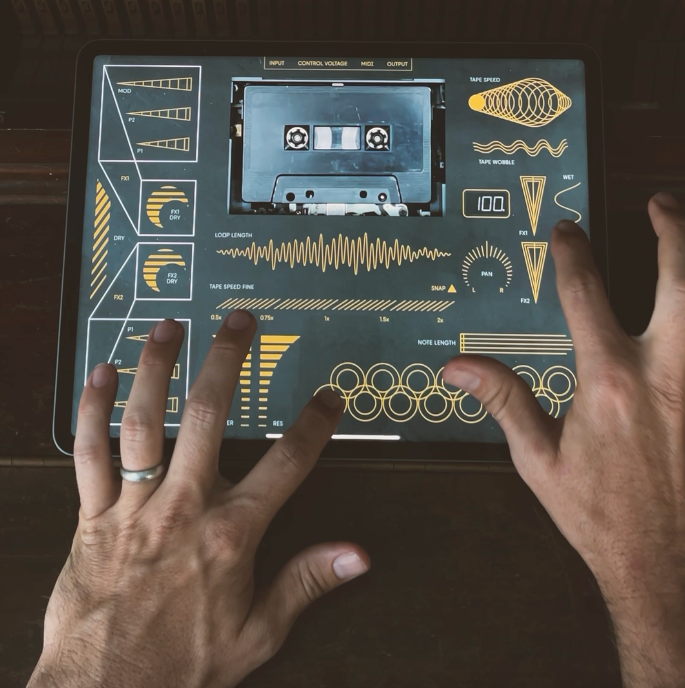

# Tape-Track-Videopak

Thanks!
First, I’m excited you’re interested in trying out this crazy videopak I started making for myself! I’m not too sure this will ever be a “commercial” videopak offering, just because it’s limiting to design the UI for many kinds of devices, as well as the fact that I just don’t have the capacity (with my full time freelance graphic/UX design business) to make this function completely bug free. One of the beauties of the Videolab environment is that you can just make things for yourself…to experiment, test, or to enhance your own music. **Please read all the info below**, so you at least know the ins and outs of how to use this videopak, and the idea behind it.

# Concepts

# Playing, Having Fun & Exploring
After collecting several synths and effects to connect to the OP-Z, I realized I was making less music..because I had to sit down in my music room and connect the OP-Z to things. This defeats one of the reasons I purchased it. It’s such a small, quick, inspiring instrument…I was losing some of the joy of sitting on the couch, making a track. I started thinking there were things I wasn’t fully exploring on the Z, mainly because I didn’t have every control easily tweakable…like an effects pedal. The Z comes fully equipped with effects and creative sound utilizations like the tape track, which is a full audio buffer, but I wasn’t pushing the envelope with anything. I thought, what if I made something that looked like a hardware device, with touch sensitive metal…like some circuit bent device, and added a cassette tape to it?!

**#onlyopz**\
Along with this epiphany, came the idea that I should really try and limit my track creation to only the OP-Z…just to push myself…and the little synth. As most people have guessed, I’m not a pro musician, and am having fun in my mid-40’s, exploring synth music. The Z seems perfect for this. As a side note, shoot me a link or something if you are creating #onlyopz tracks… I want to keep track of anyone doing that.

# Videopak Info
You really ought to read this, so you don’t get too frustrated with this “alpha release” software.
- This videopak is HUGE. 585 MB … I think it’s because I wanted the tape to look extra sharp and real, so the animation is made of high-res PNGs…and lots of them. 
- I can only confirm that the UI works on a **12” iPad Pro**. I designed it very specifically for the pixel dimensions of this iPad. This allowed me to control the design in minute detail, instead of having it work for all devices. Also I made the cassette actual size, so it would look proportioned right in videos or photos. From the top, this UI almost can pass for a piece of hardware. It probably cuts off on other devices. There probably is a way to make it fit on other devices, but would leave extra space around some of the edges. Also, the phone is too small.
- The **UI layer has to be turned off to exit the videopak**. Some weird things happen when you make “UI Touch” controls with Videolab. Or at least, when I try it. It covers up the whole OP-Z app. You can’t get out of the Videopak. I put a hidden button in the **top right corner of the UI** that turns off the UI in the videopak, so you can exit the videopak. It also means you probably have to close the OP-Z app and open it again to re-load the videopak. I can fix this with an “On” button but haven’t yet.
- **Use at your own risk**. It’s all just midi messages, but I wouldn’t use on songs you have completely dialed in without backing up first. You may end up permanently changing some parameters, and your song may never stay the same.
- It’s sending midi to the Tape Track, and both effects tracks. If you record anything while on the Motion track, sometimes it records the midi messages on those tracks also.
- Most functions are on the UI, there are additional randomize functions on the motion track.
- Current parameters aren’t changed until you change something on the UI. ***Sidenote***I still haven’t really understood how I can make videopak midi controls, control parameters relative to the current parameters on the synth.

# Control Info
- Dry - This controls the level of dry signal you hear when the tape track is played.
- FX1 - In the top left corner are the controls for whatever effects you have on that track. Honestly, I designed it for delay. So, some of the effects don’t have as many parameters. The “dry” knobs are all bottom to top. They don’t move in a circle. Everything is done with basic default unity sliders…either left to right or bottom to top.
- FX2 - Same here. Really designed it for reverb. The MOD slider may not do anything.
- Loop Length - From left to right, shortest to longest
- Loop Speed Fine - The thing to know here is that the “snap” is a button that locks the speed to increments that are musical. In pitch, I think it’s octaves and 5fths. But I don’t know for sure. You can turn snap on and off. You can also use Wobble with snap. There’s not a visual on when this is on or off. I haven’t gotten that far yet. ••• I just realized this weekend that a UI issue is preventing this control from working in the “un-snapped” mode. Sorry. I fixed in a new version, as well as added the ability to see when it’s in Snap mode or not. I’ll try to share the new version when I fix another issue*** 
- Tape Filter and Tape Resonance - Top of these vertical sliders is the highest number, bottom is the lowest. 
- Tape Speed (top right) - is the drastic speed change. I’m not sure what is going on here, but it seems to change something every .08 increments of a wheel turn. I have a randomize feature that does some cool stuff with this.
- Tape Wobble - This randomizes small variations in the tape speed. It works with Snap off and Snap on. It increases in variation from left to right.
- FX1 (middle right) - This controls the amount of FX1 on the output of the tape track.
- FX2 (middle right) - Same as FX1, but for FX2
- Pan - this is Tape Track pan L & R - drag from bottom to to. Bottom is full left I think.
- Note Length - Length of the tape track notes, when played
- Bottom circles - this is a playable keyboard for the tape track. (The bottom gray keys.) Or you could just record notes on the tape track itself.
- Wet - this is the audio level of the tape track. Bottom of the slider, you won’t hear the tape track when engaged. Top, you’ll hear it at full volume.

Hidden Motion Track Controls - There are randomize buttons on the very bottom gray keys on the motion track. Most turn on randomize, when held down or recorded. **ATTN: You MUST record notes on the Module track sequencer for randomize to work. It looks to that track to trigger randomize events at the proper time. Record a note on every step of the module track. I may change this in the future, it’s just what I did to test the randomize features.**
- F key (bottom left) - Randomize notes. This will trigger random tape track notes, at random times, when the button is pushed or recorded. (Plays the tape track)
- G - Randomize Loop Length
- A - Randomizes Tape Speed Fine (works with Snap & Wobble)
- B - Randomizes Tape Speed Coarse (This will randomize a setting when pushed, but return to 0 when released. Sometimes you have to do it twice though. Not sure why.
- C - Randomizes Filter
- D - Randomizes Resonance

# Tester / Experimentor Info
- You are brave souls, and are probably as inspired with TE products as I am. Thank you for your energy!
- Feel free to use this for whatever you want, in videos, etc. There’s nothing I’m trying to keep under wraps.
- SEND FEEDBACK! I’d love to hear your ideas. Also know that most of the add-on features are really Proof-Of-Concept… like I haven’t really “dialed in” the exact Wobble sound I want, but I know it works and just have to change some numbers.
- Features I want to add:
  * A way to view parameters, but be able to turn them on or off. This way, you can operate “blind” like effect pedals if you want.
  * On/Off visuals for things like snap.
  * Control the amount of randomization on those settings
  * Logo on the cassette tape
  * More cassette tape changes based on parameters
  * More official way to turn the UI on and off
  * Make it fit, at least more tablet devices
  * Tweak the UI .. there’s some things I would change, as well as add. Not sure if we need the keys or if I should put randomize there.

# Working Title - **Chronoscope**
I’m working on a logo that I will put on the cassette tape at some point.

[Download the Videopak Here](https://github.com/Videolab-Creators-Group/Tape-Track-Videopak/releases/download/v0.08/chronoscope.v0.08.zpak)

This was really long. Sorry. Enjoy, and stay in touch. I may add more updates, but not before I play around with this more!

-brad

I post videopak updates and experiments on my Instagram - @bradthedesigner

—--------------------------------------------------

Here’s a new version. [Chronoscope v0.08](https://github.com/Videolab-Creators-Group/Tape-Track-Videopak/releases/download/v0.08/chronoscope.v0.08.zpak)

# Notes:
- Fixed the normal “un-snapped” tape speed - it didn’t work
- Added a simple menu display to give you the values of the current control you’re changing…
Can’t figure out how to delete the decimal, will get to this later
Not everything shows in the menu at this point
- Possibly fits on different size ipads. I changed the scale option to snap to height instead of width. It might look funny, but you should be able to reach the controls.
- Tweaked wobble a bit more
- Cleaned up the UI of the keys at the bottom
